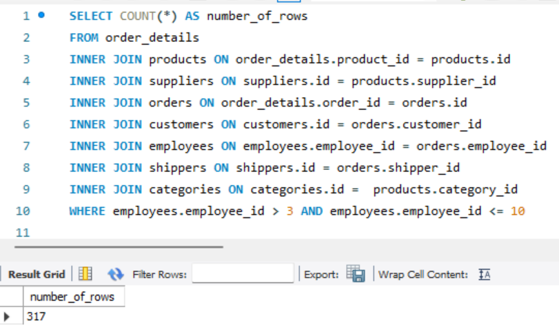
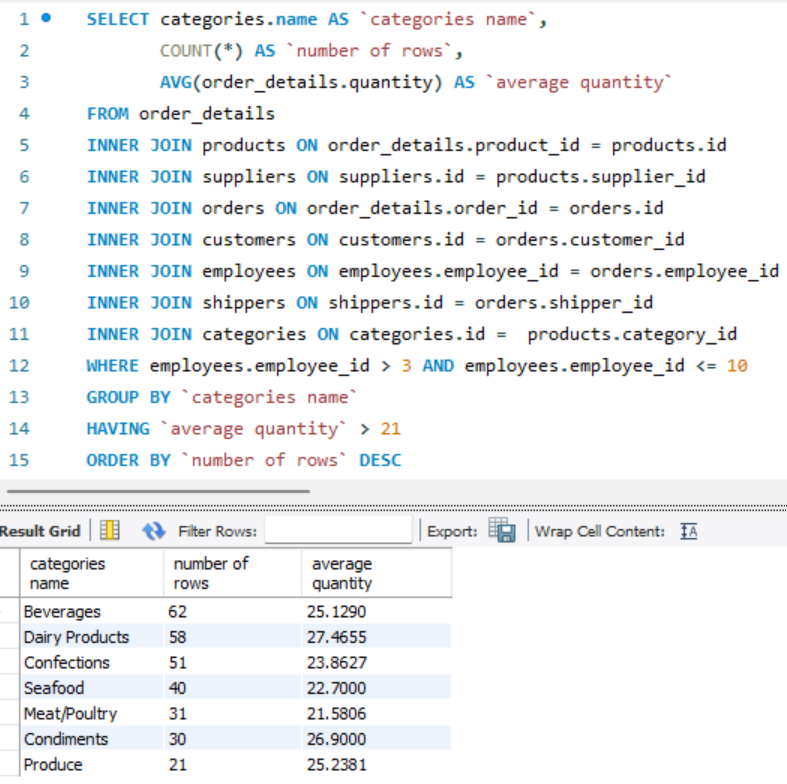

# goit-rdb-hw-04

## Task 1

### [Create schema and tables](./p1_create_tables_script.txt)

## Task 2

### [Fill in columns](./p2_fill_tables.txt)

## Task 3

### [Merges all data tables](./p3_orders_table_join_script.txt)

[Get acquainted with the entire table](./p3_orders_table.csv)

## Task 4

### [Completed the queries listed below](./p4_scripts.txt)

#### 4.1 Determine how many rows you received (using the COUNT operator).

#### 4.2 Change several INNER statements to LEFT or RIGHT. Determine what happens to the number of rows. [Why? Write the answer in a text file. ](./joins.md)

#### 4.3 Select only those rows where employee_id > 3 and ≤ 10.

#### 4.4 Group by category name, calculate the number of rows in the group, the average quantity of the product (the quantity of the product is in order_details.quantity)

#### 4.5 Filter the rows where the average quantity is greater than 21.

#### 4.6 Sort the rows in descending order of the number of rows.

#### 4.7 Display (select) the four rows with the first row omitted.

