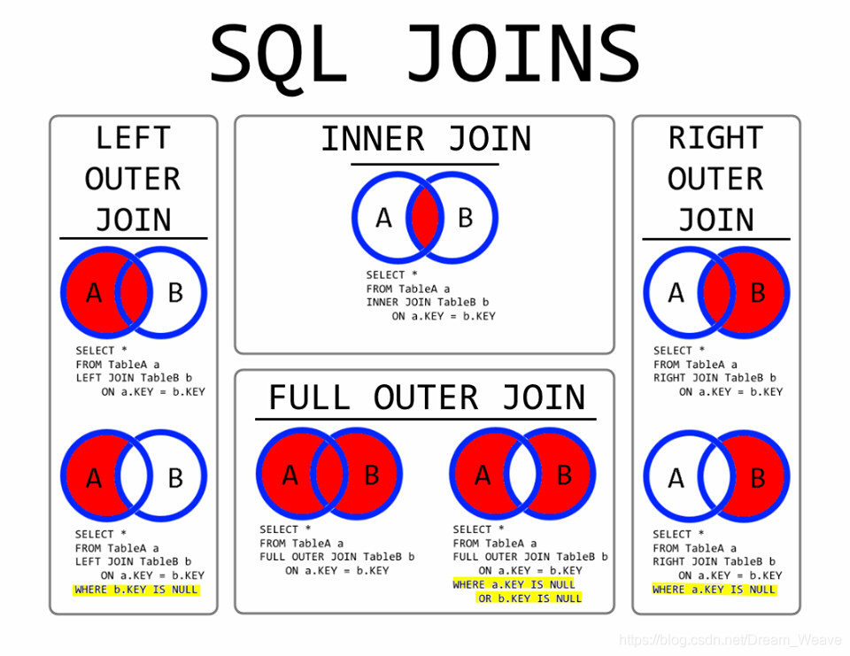
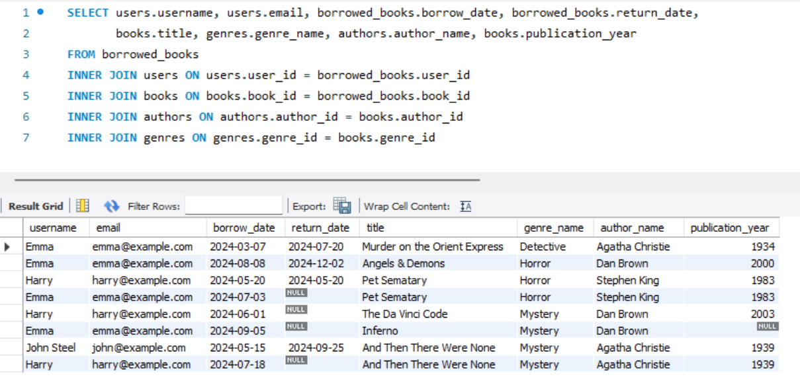

Оператор INNER JOIN вибирає спільні рядки між двома таблицями. -> Якщо є відсутні значення для зв'язку між таблицями (NULL), вони не з'являться у результатах і кількість рядків буде меншою.

Оператор LEFT JOIN (RIGHT JOIN) вибирає як спільні рядки, так і всі інші з лівої таблиці (правої таблиці). Якщо є відсутні відповідні записи у правій таблиці (лівій таблиці), результат міститиме всі записи з лівої таблиці (правої таблиці), навіть якщо у правій таблиці (лівій таблиці) NULL.

Звісно, якщо нам не потрібні NULL значення, ми можемо використати оператор WHERE для фільтрації таких значень.

borrowed_books є основною таблицею, до якої приєднуються усі інші.
* Використання INNER JOIN для таблиці users гарантує, що в результаті будуть тільки ті записи, де знайдено відповідного користувача з позиченими книгами.
* Завдяки RIGHT JOIN у результаті будуть УСІ books навіть якщо книга не була позичена.
* З'єднання через LEFT JOIN таблиць authors та genres включить у таблицю з результатами всі книги, навіть якщо до них не вказано автора чи жанр.